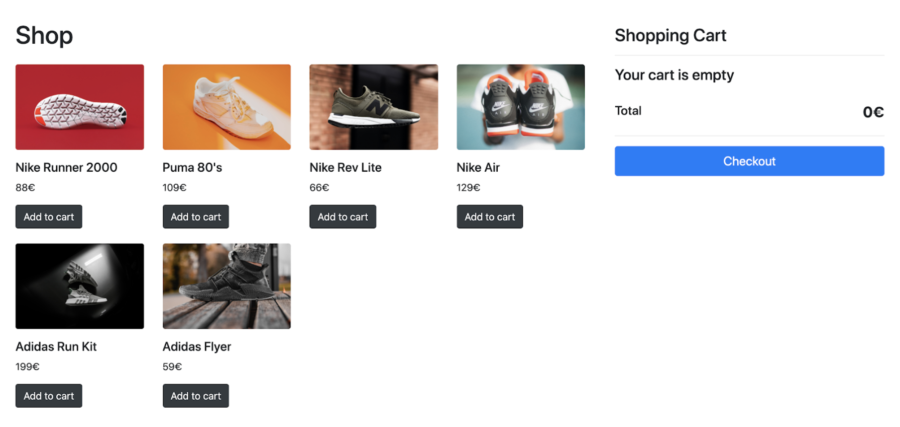
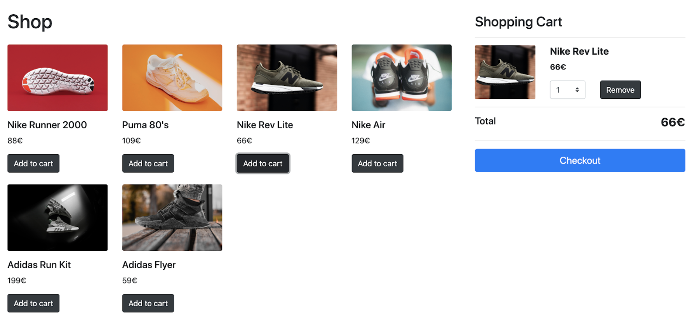
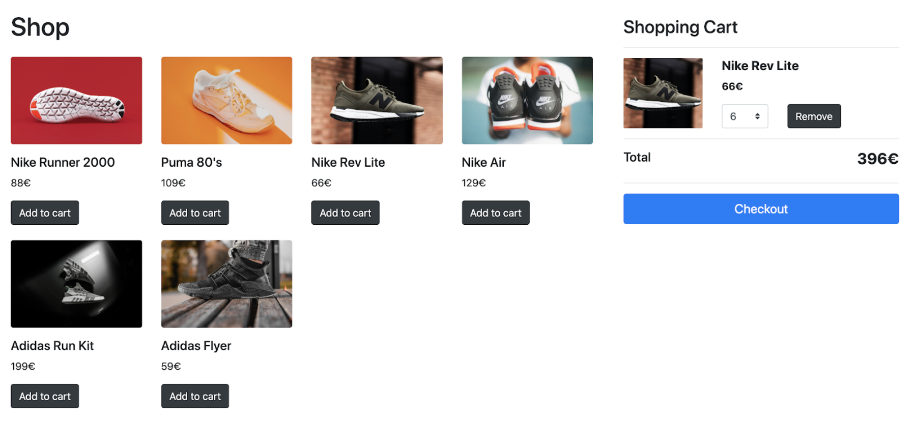
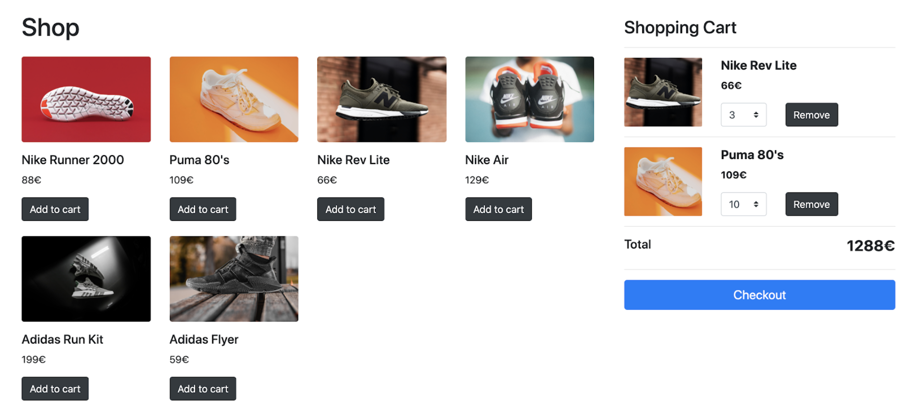

`#react-basics` `#assembler-school` `#master-in-software-engineering`

# React Basics Hooks Shopping Cart App <!-- omit in toc -->

A demo app to learn the basics of React and to create a shopping cart using hooks.

## Table of Contents <!-- omit in toc -->

- [Getting Started](#getting-started)
- [Instructions](#instructions)
- [Extra steps 💯](#extra-steps-)
- [Requirements](#requirements)
- [Available Scripts](#available-scripts)
- [Author](#author)
- [License](#license)

## Getting Started

This project was bootstrapped with [Create React App](https://github.com/facebook/create-react-app).

Run `npm i` or `yarn` in the terminal to install the dependencies.

Then, run `npm run start` or `yarn start` to start up the app.

The app will be run by default in the following url: `http://localhost:3000/`

### The repo

First, you will need to clone the repo:

```bash
$ git clone https://github.com/assembler-school/react-basics-hooks-shopping-cart.git
```

## Instructions

In this pill you will have to convert the previous pill of creating a shopping cart with classes in React.js so that it is all made with hooks.

The `main` branch of this repo has the classes solution of the previous pill so that you can get started with it.

### Instructions From the Previous Pill



Once you have installed the dependencies of the pill you will have to convert all the HTML code from the App.js file to React components such that the code is as reusable and modularized as possible.

Each UI element should be a React component, for example, buttons are UI elements that are reused in multiple places in the app so they should be extracted to React components.

### App features

Once you have modularized the app in components you will have to implement to logic so that you can create an ecommerce app.

#### Rendering the products

The products are stored in the `products.js` file which you should use to render the products to the screen dynamically using a JavaScript loop.

Each product should have the event listeners and methods needed to handle the UI interactions needed such as adding the product to the cart.

#### Add to cart



Clicking the `Add to Cart` button should add the product that was clicked to the shopping cart.

By default, the shopping cart will be empty.

The items in the cart that are visible the first time you open the app are only there as examples, you should convert them to React components which you should be able to render in the shopping cart when the `Add to Cart` button is clicked to add products to the cart.

#### Shopping cart



Once a product has been added to the cart you should be able to:

- Edit the product quantity using the select element which will update the cart’s total price
- Remove items from the cart which will update the cart’s total price
- The cart total price should always be updated so that it represents the total cost of all the items in the cart
- When the cart is empty you should conditionally render a message inside the cart saying that the cart is empty. Then, when the cart has had items added, you should instead render the cart items and remove the default message.

### State management

You should use React to handle the state management in the app. You cannot use a state management library.

## Extra steps 💯

Once you have finished the initial part of the pill you should implement the following steps to improve your skills:



- You should check if the cart item has already been added to the cart to only update the quantity instead of adding it again. The quantity should not be larger than 10 units for each product
- Store the items in local storage and load them if the page is reloaded so that the cart items are not lost of page refresh
- Each time the page is refreshed you should load the cart items from local storage to save them in the React state so that the app renders with the contents from local storage if there is any. Otherwise, the cart should display the default message of “Your cart is empty”

## Requirements

- You should extract and modularize all the UI elements to React components
- The products must be rendered dynamically using JavaScript loops
- The products should be rendered as React components
- You cannot use external state management libraries
- All the components that require state should be created using React
- Use `classes` and `setState` methods to update the state of the application

## Available Scripts

In the project directory, you can run:

### `yarn start`

Runs the app in the development mode.<br />
Open [http://localhost:3000](http://localhost:3000) to view it in the browser.

The page will reload if you make edits.<br />
You will also see any lint errors in the console.

## Learn More <!-- omit in toc -->

You can learn more in the [Create React App documentation](https://facebook.github.io/create-react-app/docs/getting-started).

To learn React, check out the [React documentation](https://reactjs.org/).

## Author

[Dani Lucaci](https://www.danilucaci.com/).

## License

Licensed under the [MIT License](./LICENSE).
